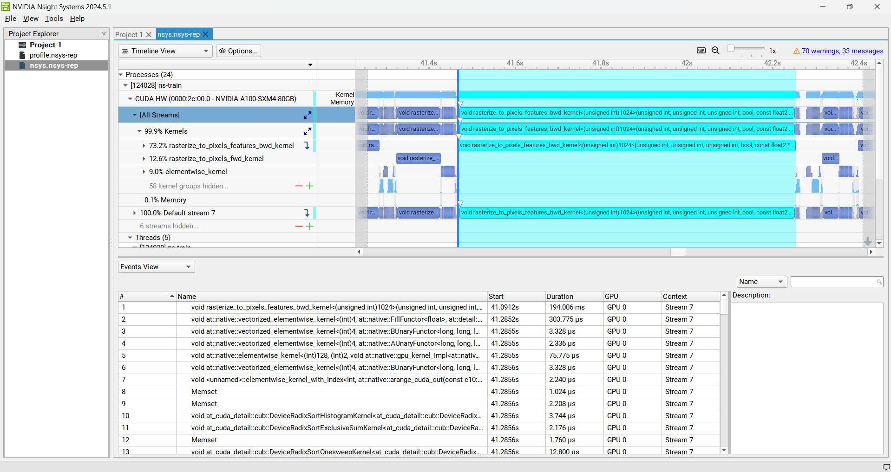

# Feature Splat
- We modify the cuda kernel so that we can tuning uo to 1024 dimension features

## Issues
- CUDA is always out of memory

## Detailed Implementation
- We imeplement: feature_splat/cuda/csrc/rasterization.cu 
- We by pass most of the back propagation path to speed up and reduce the memory consumption

## However, the meory usage is still an issue
Currently when we decrease the train iteration to 10, everything is fine. When we increase the training loop. there will be a CUDA OOM

## Install
- First install nerfstudio as follow: https://docs.nerf.studio/
- Second pip install .
